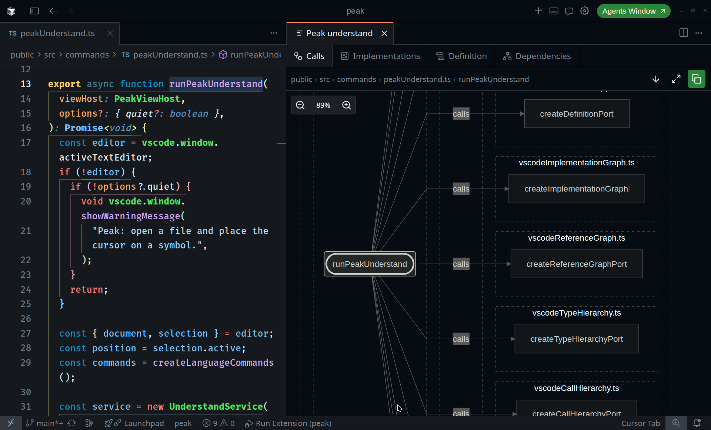
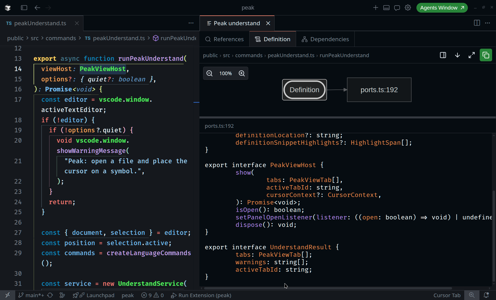

# Peak

> **This is still alpha software** — APIs and UX may change. Feedback welcome via [GitHub Issues](https://github.com/ultinotes/peak/issues).

## What is Peak?

Whether you are reviewing agentic code or trying to understand a complex codebase, you might want to have a visual helper
to understand the underlying structure of the code. Peak helps you with that by visualizing the LSP features that VSCode
already provides, like **call hierarchy**, **file dependency graphs**, **definition preview**, and more.

  
  <!--  -->

### What else can Peak do?
- The diagram panel follows your cursor
- Copy **mermaid** diagram code for the active tab
- Interfaces LSP providers through VS Code's API, so no custom plugins or integrations are needed

...and much more!

## How do I install the plugin?

- [Open VSX](https://open-vsx.org/extension/peak/peak) (Cursor, VSCodium)
- [Visual Studio Marketplace](https://marketplace.visualstudio.com/items?itemName=peak.peak) (VS Code)

Or install a `.vsix` from [Releases](https://github.com/ultinotes/peak/releases).

## Using Peak

1. Open a source file and place the cursor on a symbol (call hierarchy) or anywhere in the file (dependencies).
2. Run **Peak understand** from the editor context menu or Command Palette (`Ctrl+Shift+P` / `Cmd+Shift+P`).
3. A Peak panel opens in an editor tab beside your file with Mermaid diagrams. The action bar shows the current file path and symbol at your cursor. Use **Copy diagram code** to copy the active tab's source.

## This is how it looks

### Call Hierarchy

### Definition Preview

## Customizing Peak

| Setting                           | Default | Description                                                                               |
| --------------------------------- | ------- | ----------------------------------------------------------------------------------------- |
| `peak.updateOnCursorMove`         | `true`  | Reload the panel when the cursor moves while it is open                                   |
| `peak.definitionPreviewPlacement` | `right` | Default definition snippet placement inside the panel (toggle in panel on Definition tab) |

## System requirements

- VS Code or Cursor **1.104+**
- Language support with call hierarchy and/or definition providers for your file type (TypeScript works out of the box)

## How to develop?

See [SETUP.md](SETUP.md). MIT — [LICENSE](LICENSE).
